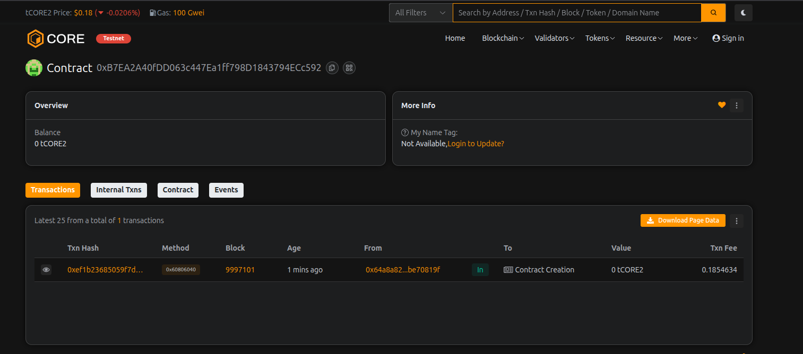

# YieldX Network

## Project Description

YieldX Network is a decentralized yield aggregation and optimization platform built on the Ethereum blockchain. The platform enables users to deposit their crypto assets and earn competitive yields through automated optimization strategies. By leveraging smart contract technology, YieldX Network provides a transparent, secure, and efficient way for users to maximize their returns while maintaining full custody of their assets.

The platform features multiple yield pools with varying APYs, automated yield distribution, and a governance-ready architecture. Users can deposit ETH, track their earnings in real-time, claim yields on demand, and withdraw their principal at any time without lock-up periods.

## Project Vision

Our vision is to democratize access to high-yield opportunities in the decentralized finance (DeFi) ecosystem. YieldX Network aims to become the leading yield optimization protocol by:

- **Eliminating Complexity**: Making yield farming accessible to everyone, regardless of technical expertise
- **Maximizing Returns**: Automatically routing user funds to the highest-yielding opportunities
- **Ensuring Security**: Implementing robust smart contract architecture with transparent operations
- **Building Community**: Creating a decentralized governance model where users control the platform's future
- **Promoting Financial Inclusion**: Providing equal access to yield opportunities without minimum deposit requirements or geographical restrictions

We envision a future where yield optimization is seamless, secure, and accessible to all participants in the global financial system.

## Key Features

### 1. **Flexible Deposits & Withdrawals**
   - Deposit ETH anytime without minimum requirements
   - Withdraw funds at any time without lock-up periods
   - No penalties for early withdrawal

### 2. **Automated Yield Generation**
   - Competitive APYs on deposited assets
   - Automatic yield calculation based on time elapsed
   - Real-time tracking of pending rewards

### 3. **On-Demand Yield Claims**
   - Claim accumulated yields without withdrawing principal
   - Transparent fee structure (5% platform fee)
   - Instant reward distribution

### 4. **Multiple Yield Pools**
   - Create and manage multiple yield pools with different APYs
   - Pool-specific strategies for risk/reward optimization
   - Dynamic pool management by platform administrators

### 5. **Transparent Operations**
   - All transactions recorded on-chain
   - Real-time visibility of total deposits and yields distributed
   - Comprehensive event logging for tracking activities

### 6. **User Dashboard Capabilities**
   - View deposit amount and timing
   - Track total rewards claimed
   - Calculate pending yields in real-time
   - Monitor overall platform statistics

## Future Scope

### Phase 1: Enhanced Functionality (Q1-Q2 2026)
- **Multi-Asset Support**: Enable deposits of various ERC-20 tokens beyond ETH
- **Compound Yield Feature**: Auto-compound rewards back into principal
- **Referral System**: Reward users for bringing new depositors to the platform
- **Advanced Analytics Dashboard**: Provide detailed yield history and projections

### Phase 2: DeFi Integration (Q3-Q4 2026)
- **Cross-Protocol Yield Aggregation**: Integrate with major DeFi protocols (Aave, Compound, Curve)
- **Automated Strategy Vaults**: Smart routing to highest-yielding opportunities
- **Liquidity Mining Programs**: Additional token rewards for early adopters
- **NFT Reward Tiers**: Exclusive benefits for long-term depositors

### Phase 3: Governance & Decentralization (2027)
- **DAO Governance Token**: Launch native governance token (YIELDX)
- **Community Voting**: Enable token holders to vote on platform parameters
- **Treasury Management**: Community-controlled treasury for protocol development
- **Staking Mechanisms**: Stake governance tokens for boosted yields

### Phase 4: Advanced Features (2027-2028)
- **Cross-Chain Deployment**: Expand to multiple blockchain networks (Polygon, Arbitrum, Optimism)
- **Insurance Integration**: Partner with DeFi insurance protocols for user protection
- **Yield Derivatives**: Create tradeable yield tokens and structured products
- **AI-Powered Optimization**: Machine learning algorithms for yield prediction and optimization
- **Mobile Application**: Native iOS and Android apps for seamless user experience

### Long-Term Vision
- Establish YieldX Network as a core infrastructure layer for DeFi yield optimization
- Build strategic partnerships with institutional investors and protocols
- Achieve full decentralization with community-driven development
- Expand into traditional finance integration through regulated bridges

---

## Technical Specifications

- **Solidity Version**: ^0.8.19
- **License**: MIT
- **Network**: Ethereum (EVM-compatible chains)
- **Core Functions**: 5 main functions + utility functions

## Getting Started

1. Deploy the `YieldXNetwork.sol` contract to your preferred Ethereum network
2. Users can interact with the contract through Web3 interfaces
3. Monitor platform statistics and user activities through blockchain explorers

## Security Considerations

- All funds are stored in the smart contract with transparent withdrawal mechanisms
- Owner functions are restricted to administrative tasks only
- Platform fee capped at maximum 20% to prevent abuse
- Time-based yield calculations prevent manipulation

---

## Contract Details:

Transaction id: 0xB7EA2A40fDD063c447Ea1ff798D1843794ECc592
